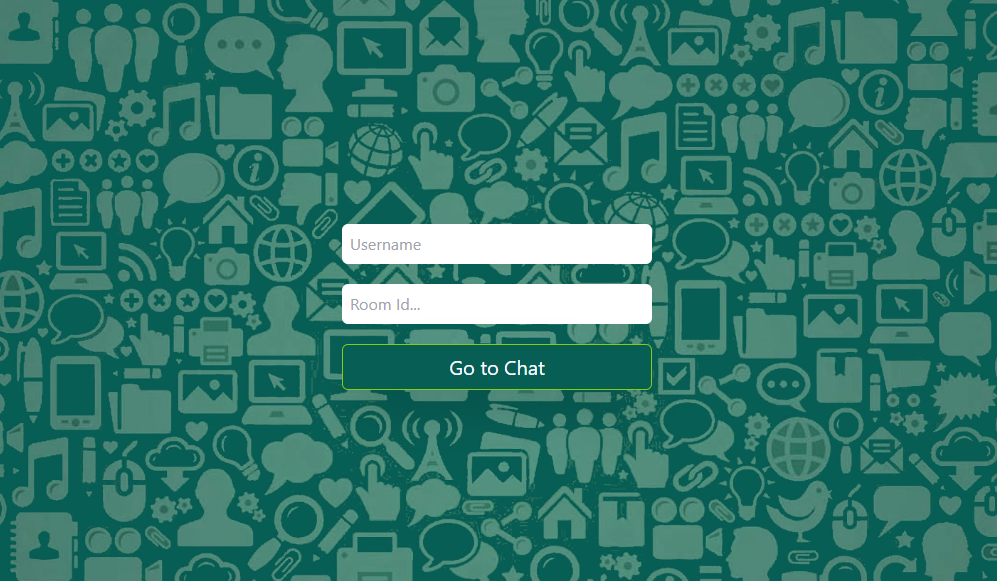
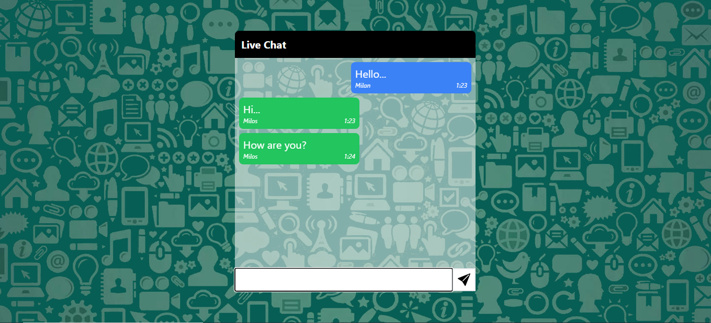

# Chat_app

## This project is based on the use of Socket.IO, Node.js, and React technologies to create a powerful real-time chat application. This application allows users to connect and communicate with each other in real-time, providing a fast, reliable, and interactive platform for message exchange.

<a href="https://chat-app-beta-roan.vercel.app/">Demo</a>

